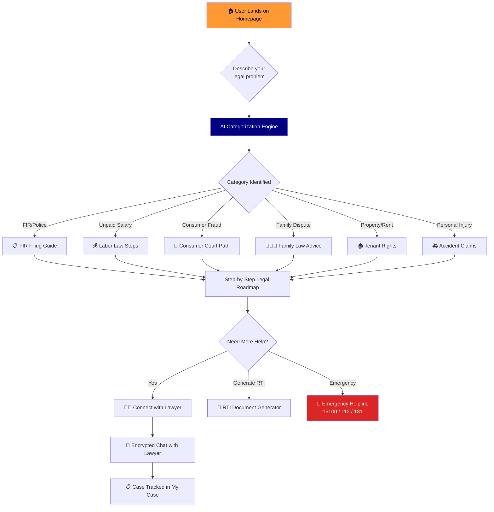
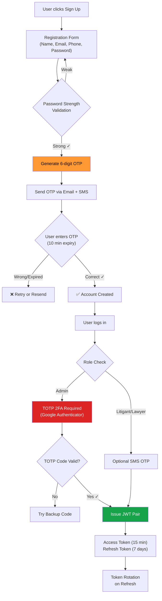
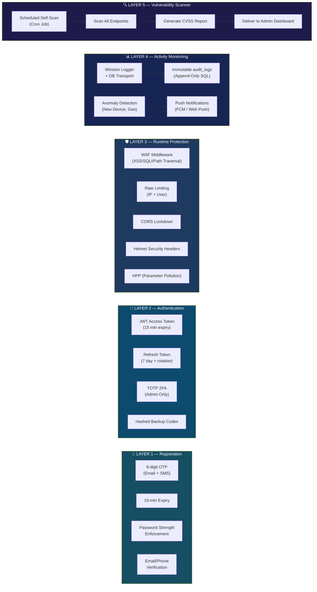
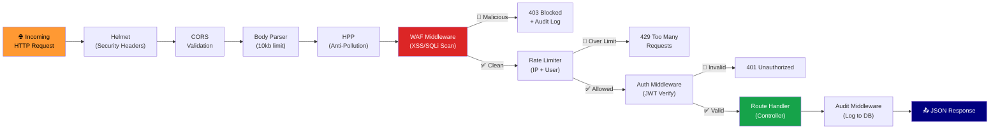
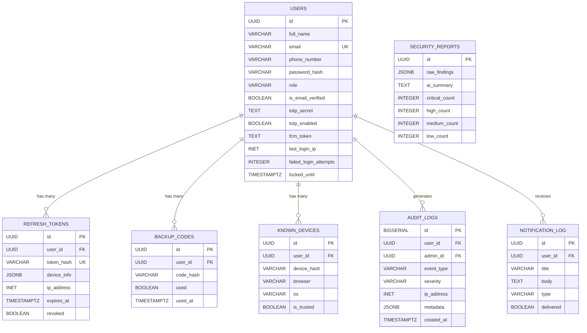
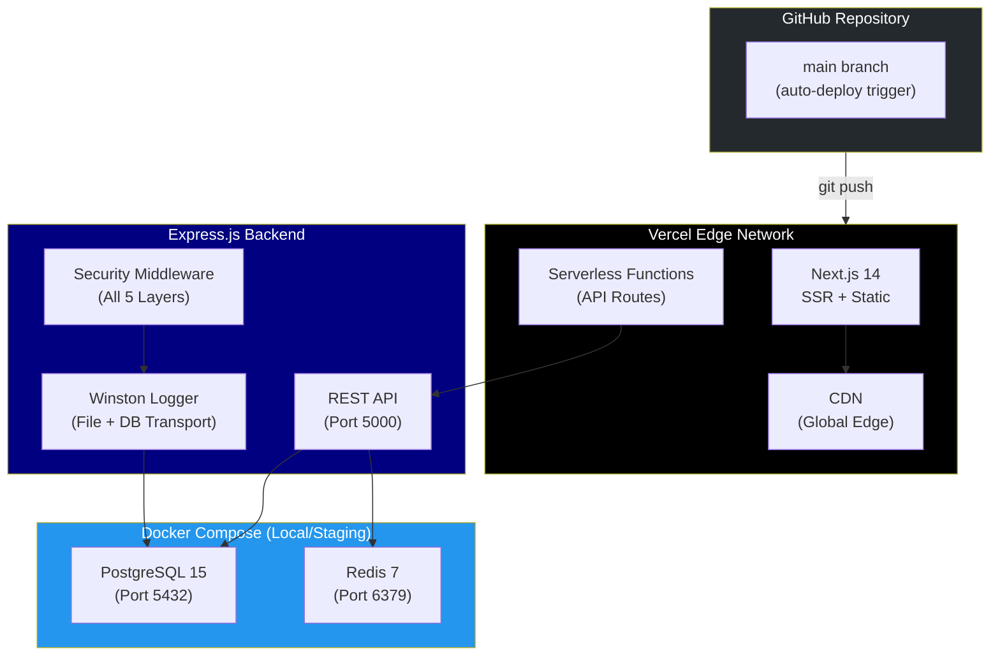
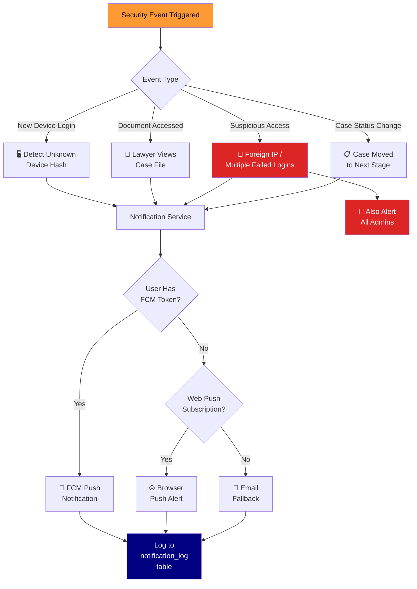

# Chitragupta — Technical Flowcharts & Architecture Diagrams

> Hackathon reference document — visual breakdown of every user flow and security layer.

---

## 1. User Journey Flow (End-to-End)

---

## 2. Authentication & Security Flow

---

## 3. 5-Layer Security Architecture

---

## 4. Request Processing Pipeline

---

## 5. Database Entity Relationship

---

## 6. Deployment Architecture

---

## 7. Notification Alert Flow

---

*These diagrams render automatically on GitHub, in VS Code (with Mermaid extension), and in most markdown viewers.*
